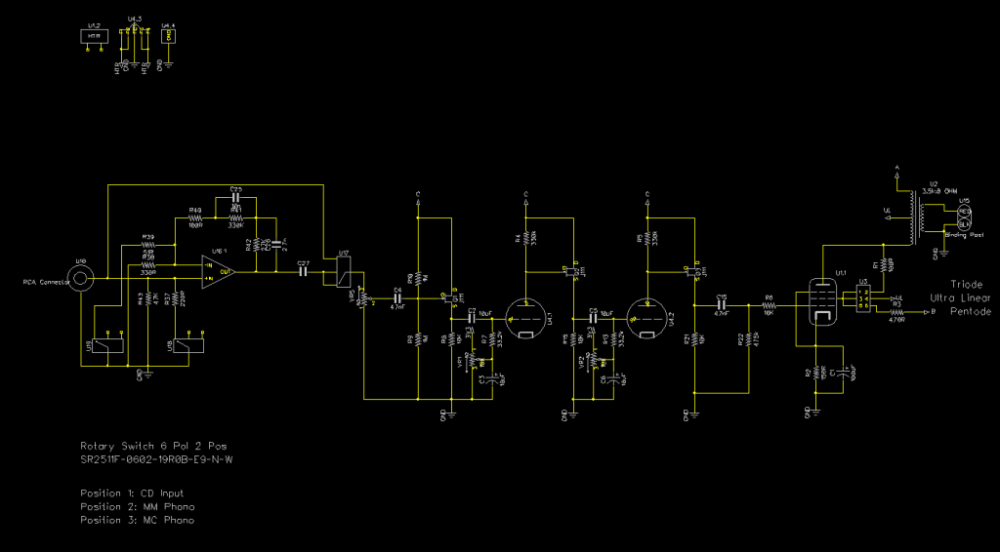
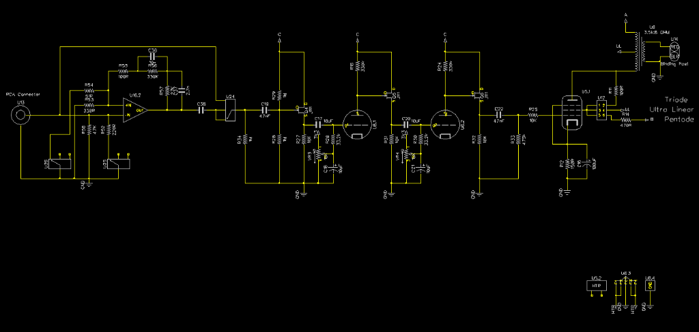
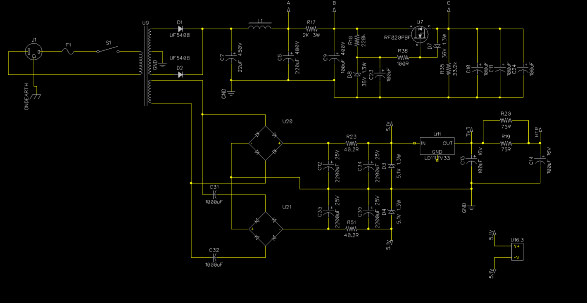
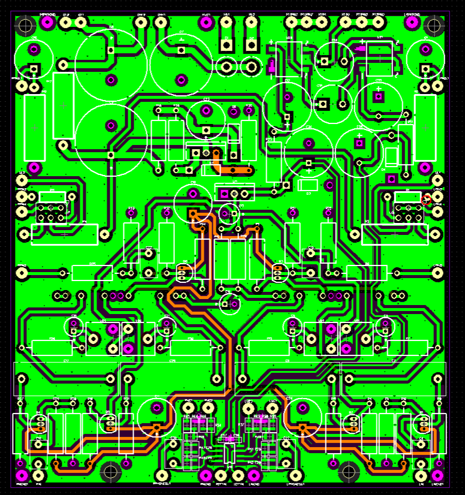
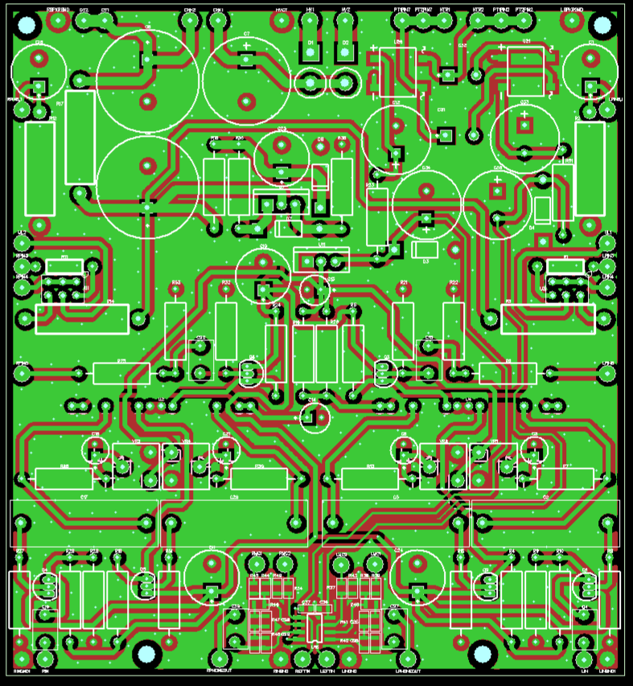

###Macro_Amp
***
**Stereo Hifi tube amplifier pcb using the KORG Nutube**

***

***

***

***

***

Files are for Diptrace 2.4. Gerber files can be found in the Manufacturing Files directory. See main directory for licensing. 
